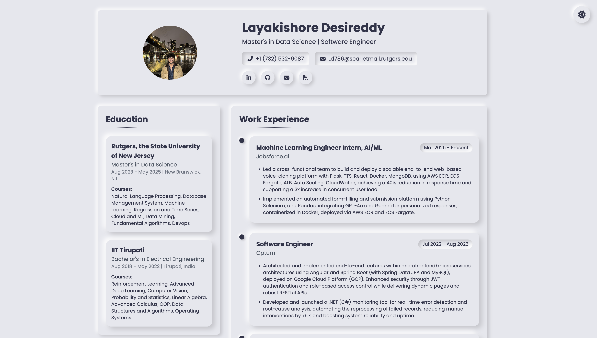

# Portfolio Website - Layakishore Reddy Desireddy

A modern, responsive personal portfolio website built with HTML, CSS, and JavaScript featuring a neumorphic design with dark mode support.



## Features

- **Responsive Design**: Fully responsive layout that works on all devices
- **Neumorphic UI**: Modern soft UI design with beautiful shadows and depth
- **Dark Mode**: Toggle between light and dark themes with persistent preference storage
- **System Theme Detection**: Automatically detects and matches user's system theme preference
- **Animated Elements**: Subtle animations for enhanced user experience
- **SEO Friendly**: Proper semantic HTML structure for better search engine visibility

## Technologies Used

- HTML5
- CSS3 (with CSS Variables)
- JavaScript (ES6+)
- Tailwind CSS
- Font Awesome Icons
- Google Fonts (Poppins)

## Project Structure

```
Portfolio/
├── index.html     # Main HTML file
├── profile_pic.jpeg   # Profile picture
├── Resume_dlkr.pdf    # Downloadable resume
└── README.md          # Project documentation
```

## Setup and Usage

1. Clone the repository:
   ```
   git clone https://github.com/Layakishorereddy11/Portfolio.git
   cd portfolio
   ```

2. Open `portfolio.html` in your browser:
   ```
   open portfolio.html
   ```

3. To make changes:
   - Edit `portfolio.html` to update content and structure
   - Modify the CSS styles in the `<style>` section for visual changes
   - Update JavaScript for functionality adjustments

## Dark Mode Implementation

The website implements a dark mode toggle with the following features:

- Theme preference saved in `localStorage`
- System preference detection using `prefers-color-scheme` media query
- Smooth transitions between themes
- CSS variables for consistent theming
- Adapted neumorphic shadows for both light and dark modes

## License

MIT © Layakishore Reddy Desireddy

## Contact

- Email: ld786@scarletmail.rutgers.edu
- LinkedIn: [Layakishore Reddy](https://www.linkedin.com/in/layakishore-reddy-0710521b4)
- GitHub: [Layakishorereddy11](https://github.com/Layakishorereddy11) 